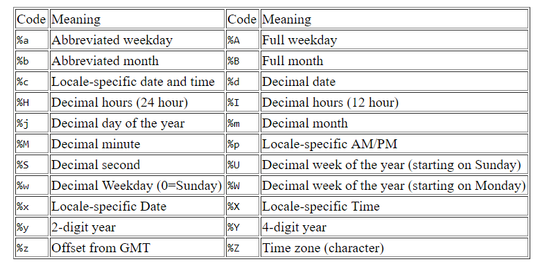

一般我們在處理時間的時候會比較麻煩,因為他是60進位.(廢話!!)  
以前我在處理的時候會特地寫個60進位的函數來處理,順便練習一下邏輯概念.但是後來發現R其實內建函數就能處理得很好了...

```{r}
time_var <- "08:00:00"
test_a <- as.POSIXlt(time_var,format = '%H:%M:%S')
test_b <- as.POSIXct(time_var,format = '%H:%M:%S')
test_a;test_b


```

## POSIXct & POSIXlt
POSIXct是以1970年1月1號開始的以秒進行儲存.如果是負數,則是1970-01-01年以前. 
POSIXlt是以list的形式儲存：年、月、日、時、分、秒,所以可以利用$單獨存取分或秒等等的時間.

### POSIXlt
```{r}
test_a$min;test_a$hour
unclass(test_a)
```

### POSIXct
```{r}
unclass(test_b)

```
#15641852800秒

### 時間的加總
可以直接對POSIXt物件進行運算
```{r}
test_a + 70
test_b + 70
test_a - test_b
```

```{r}
test_b <- as.POSIXct("09:10:00",format = '%H:%M:%S')
diff <- test_a - test_b
diff
str(diff)
```

也可以透過`as.numeric()`來將其轉成純數值.

```{r}
as.numeric(diff)
```

由上面程式碼可以發現當時間差超過一小時之後,其單位會轉換成小時.這樣當不同筆資料時間差超過一小時以上,再透過`as.numeric()`轉換成數值時會有單位上的誤差,如下面程式碼:

```{r}
test_b <- as.POSIXct('08:11:00',format = '%H:%M:%S')
diff <- test_a - test_b
diff
as.numeric(diff)
```

這時候我們就可以透過`difftime()`來設定單位進行時間上的運算.  

difftime(time1, time2, tz,units = c("auto", "secs", "mins", "hours","days", "weeks"))

```{r}
test_b <- as.POSIXct("09:10:00",format = '%H:%M:%S')
diff <- difftime(test_a,test_b,units = "mins")
diff
```
```{r time_code, echo=FALSE, fig.cap="A caption",out.width = '50%',fig.cap ='另外附上時間轉換格式對應表供日後我查詢使用'}



```


